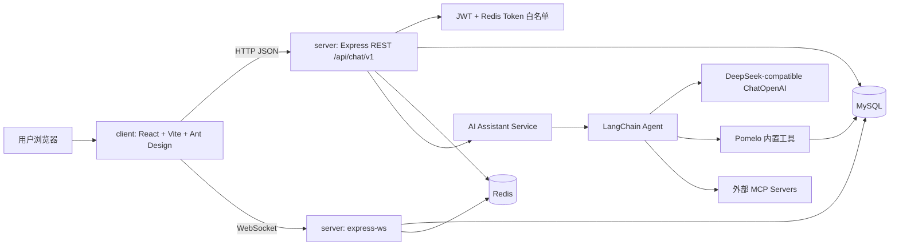
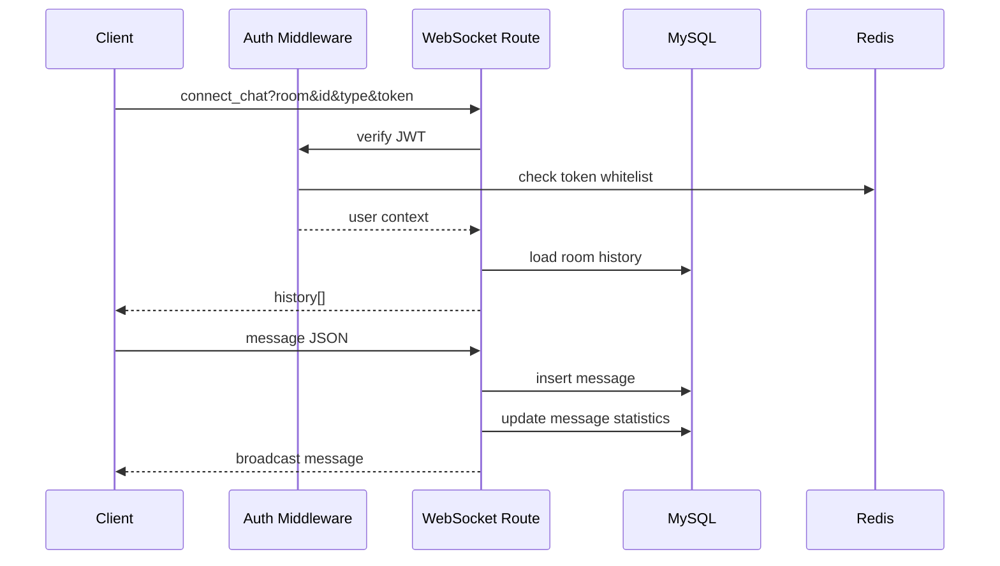
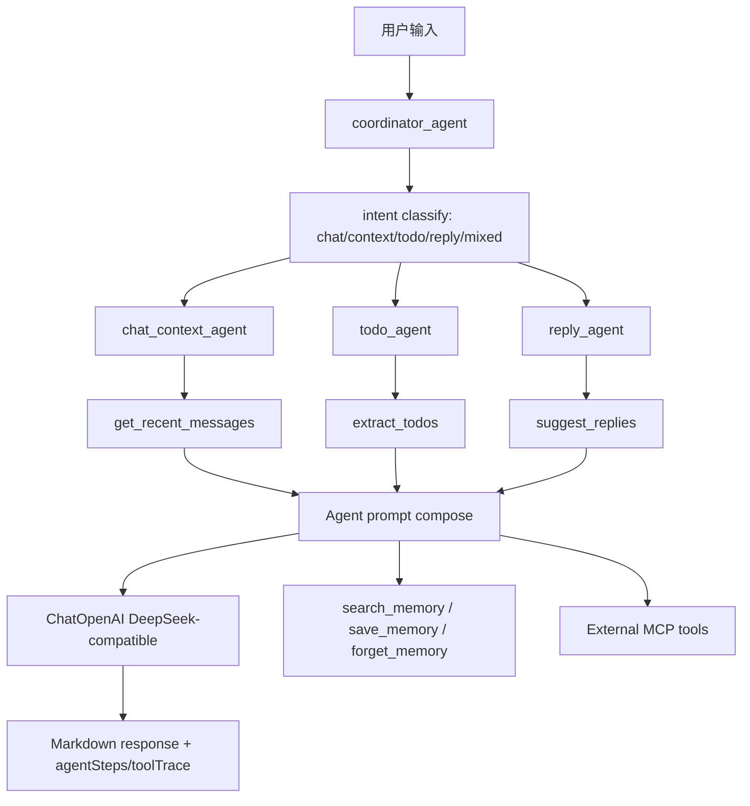
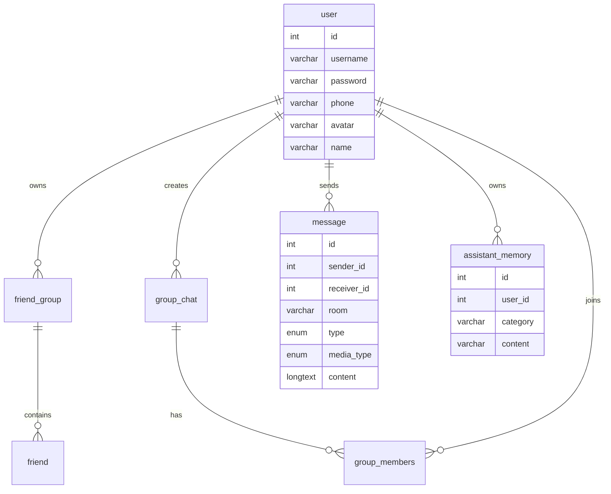

# Pomelo Chat

Pomelo Chat 是一个即时通讯应用原型，前端提供类微信聊天体验，后端通过 HTTP、WebSocket、MySQL、Redis 和 LangChain Agent 支撑用户、好友、群聊、文件、RTC 信令和 AI 助手能力。

本文只描述当前仓库代码中已经存在的能力。

## 架构总览



## 核心能力

- 用户注册、登录、登出、找回密码、资料更新。
- 好友分组、好友搜索、好友添加、通讯录展示。
- 单聊和群聊消息，WebSocket 实时收发，MySQL 持久化。
- 群创建、群成员查询、邀请入群。
- 文件分片上传、合并与受控访问。
- RTC 信令相关路由。
- AI 助手问答、SSE 流式接口、Agent 执行链路、短长期记忆表。
- 本地 MCP stdio server，以及外部 MCP 配置加载。

## 技术栈

| 层级 | 实现 |
| --- | --- |
| 前端 | React 18, TypeScript, Vite, Ant Design, React Router, Axios, Less |
| 后端 | Node.js, Express, express-ws, TypeScript |
| 数据 | MySQL, Redis ioredis |
| 认证 | JWT, Redis token whitelist |
| AI | LangChain `createAgent`, `ChatOpenAI`, DeepSeek-compatible API |
| MCP | `@modelcontextprotocol/sdk`, stdio / SSE / streamable HTTP |
| 文件 | Multer, fs-extra, uploads 静态受控访问 |

## 代码结构

```text
.
├── client/                  # React 前端
│   ├── src/config/           # API / WebSocket base URL
│   ├── src/hooks/            # AI 助手等业务 hooks
│   ├── src/pages/            # 页面
│   └── src/utils/            # axios、WebSocket 等工具
├── server/                  # Express 后端
│   ├── src/controller/       # 路由注册
│   ├── src/model/            # MySQL pool 与建表
│   ├── src/service/          # auth/friend/group/message/file/assistant
│   ├── src/mcp/              # Pomelo MCP stdio server
│   └── scripts/              # Agent/MCP/安全回归脚本
├── qa/                      # QA 自动化、Postman、AI 评测集
└── README.md
```

## 后端路由

所有 REST API 前缀为 `/api/chat/v1`。

| 路由 | 用途 |
| --- | --- |
| `/auth` | 用户认证、用户信息、用户 WebSocket channel |
| `/friend` | 好友、好友分组、搜索、添加 |
| `/group` | 群列表、群信息、建群、邀请、成员 |
| `/message` | 聊天列表、聊天 WebSocket |
| `/file` | 文件校验、分片上传、合并 |
| `/rtc` | 音视频通话信令 |
| `/assistant` | AI 聊天、流式聊天、Agent、工具列表、工具调用 |

## 消息链路



## AI Agent 与 MCP



内置工具位于 `server/src/service/assistant/tools/pomelo-tools.ts`：

- `get_recent_messages`
- `search_contacts`
- `search_groups`
- `extract_todos`
- `suggest_replies`
- `search_memory`
- `save_memory`
- `forget_memory`

外部 MCP 配置由 `MCP_SERVERS_JSON` 读取，实现在 `server/src/service/assistant/tools/external-mcp.ts`。本地 stdio MCP server 位于 `server/src/mcp/pomelo-stdio.ts`，启动脚本为 `npm --prefix server run mcp:stdio`。

## 数据模型

启动后端时，`server/src/model/db.ts` 会按顺序创建以下 MySQL 表：



## 环境变量

后端常用配置：

```env
PORT=3000
JWT_SECRET=change-me

DB_HOST=127.0.0.1
DB_PORT=3306
DB_USER=root
DB_PASSWORD=
DB_NAME=pomelo-chat

REDIS_URL=
REDIS_HOST=127.0.0.1
REDIS_PORT=6379
REDIS_PASSWORD=
REDIS_DB=0

DEEPSEEK_API_KEY=
DEEPSEEK_BASE_URL=https://api.deepseek.com
DEEPSEEK_MODEL=deepseek-chat

MCP_SERVERS_JSON=[]
POMELO_MCP_USER_ID=1
POMELO_MCP_ROOM=
```

前端常用配置：

```env
VITE_API_BASE=http://127.0.0.1:3000/api/chat/v1
VITE_WS_BASE=ws://127.0.0.1:3000/api/chat/v1
VITE_SERVER_URL=http://127.0.0.1:3000
VITE_SERVER_PORT=3000
```

未配置 `VITE_API_BASE` / `VITE_WS_BASE` 时，前端会根据当前浏览器 host 拼接后端地址，方便局域网调试。

## 本地运行

```powershell
npm install
npm --prefix server install
npm --prefix client install

npm run dev:server
npm run dev:client
```

构建：

```powershell
npm run build
```

## 测试与 QA

```powershell
npm --prefix server run test:agent-routing
npm --prefix server run test:agent
npm --prefix server run test:mcp
npm --prefix server run test:security

node qa/unit-agent-logic.test.js
node qa/ai-eval.js
node qa/qa-full-test.js
```

补充产物：

- `PROJECT_TEST_MAP.md`
- `MCP_TEST_REPORT.md`
- `QA_REPORT.md`
- `qa/postman_collection.json`
- `qa/playwright/ai-assistant.e2e.spec.ts`
- `qa/ai-eval-cases.json`

`qa/qa-full-test.js` 依赖运行中的后端、MySQL、Redis 和可用 AI/MCP 配置。Playwright E2E spec 已生成，但仓库当前没有安装 Playwright 依赖。

## 当前已知限制

- 登录逻辑使用 Redis token 白名单，同一账号重复登录会被拦截，当前不是多设备在线模型。
- Agent stream 接口返回 Agent 事件和最终内容，不是严格 token 级逐字流。
- MySQL 建表在服务启动时执行，当前没有独立 migration 框架。
- 外部 MCP 写工具需要显式确认路径，自动 Agent 不直接暴露写工具。
- 前端生产构建存在 Vite chunk size warning，功能不受影响，但后续可做代码分包。

## 测试账号

本地 QA 脚本曾创建以下测试账号和群聊数据，具体是否存在取决于当前数据库：

| 账号 | 密码 | 用途 |
| --- | --- | --- |
| `test_alice` | `Pomelo123` | 好友、群聊、AI 助手测试 |
| `test_bob` | `Pomelo123` | 好友互发消息 |
| `test_carol` | `Pomelo123` | 群聊成员 |
| `test_dave` | `Pomelo123` | 群聊成员 |

测试群名：`测试群-Pomelo-2026-07-21`。

## License

ISC
