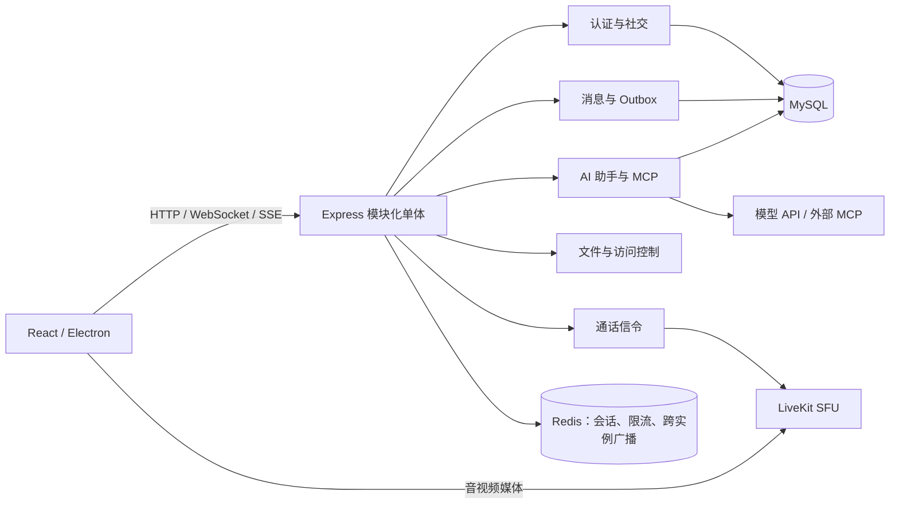

# Pomelo Chat

Pomelo Chat 是一个支持浏览器与 Electron 桌面的即时通讯项目，提供单聊、群聊、文件传输、音视频通话和 AI 助手。


当前桌面界面，使用演示会话与模拟 AI 回复。

## 项目架构

采用 **TypeScript 模块化单体**：后端在一个 Node.js 进程内运行，通过模块公开接口协作。业务查询和事务由 Prisma 访问 MySQL；用户、部分文件及房间权限查询使用模型 API，复杂 SQL 保留在 repository 和 read-model 中，当前不包含 Go 服务。


```mermaid
flowchart LR
  Client["React / Electron"] -->|HTTP / WebSocket / SSE| Server["Express 模块化单体"]
  Server --> Identity["认证与社交"]
  Server --> Messaging["消息与 Outbox"]
  Server --> Assistant["AI 助手与 MCP"]
  Server --> Files["文件与访问控制"]
  Server --> RTC["通话信令"]
  Identity --> MySQL[(MySQL)]
  Messaging --> MySQL
  Assistant --> MySQL
  Server --> Redis[("Redis：会话、限流、跨实例广播")]
  Assistant --> Model["模型 API / 外部 MCP"]
  RTC --> LiveKit["LiveKit SFU"]
  Client -->|音视频媒体| LiveKit
```

| 层级 | 实现 |
| --- | --- |
| 客户端 | React 18、TypeScript、Vite、Ant Design |
| 桌面端 | Electron 主窗口与可折叠助手侧栏 |
| 后端 | Node.js、Express、express-ws，HTTP / WebSocket / SSE |
| 数据与状态 | MySQL 8+、Prisma 7 / MariaDB 驱动、Redis / ioredis；mysql2 用于表结构迁移 |
| AI | LangChain `createAgent`、千问兼容接口、MCP |
| 音视频 | LiveKit SFU，后端校验成员权限并签发房间 token |

后端划分为 `identity`、`social`、`messaging`、`files`、`rtc`、`assistant`、`realtime` 七个模块。跨模块通过 `public.ts` / `contracts.ts` 调用，`composition.ts` 组装依赖，`runtime.ts` 管理后台任务及资源关闭。详见 [后端架构](server/ARCHITECTURE.md)。

## 核心能力

- 注册登录、资料与密码管理、好友分组、建群及邀请成员。
- 单聊与群聊实时消息、聊天记录搜索、历史定位、未读数和私聊已读回执。
- 附件分片上传、合并及鉴权下载；LiveKit 语音和视频通话。
- 私聊和群聊支持拖拽文件到聊天区上传并发送；一次最多 10 个文件，单个不超过 100MB，不支持文件夹。
- 附件保留原文件名，支持从“聊天文件”按会话、文件类型分页浏览和下载；历史未保存原名的附件保留存储文件名。
- 输入框工具栏提供“下一步建议”，按需生成并填入草稿，发送仍需用户确认；默认头像、文件与通话图标随应用本地分发。
- AI 流式问答、聊天总结、回复建议、个人待办和用户隔离的记忆。
- 主聊天页支持确认式发消息、保存待办和记忆操作；桌面助手侧栏支持对话、总结、回复建议、复制和草稿确认发送。

在 AI 独立会话中请求代写消息后，Copilot 会展开草稿发送卡。明确选择私聊或群聊对象、修改正文，点击“核对发送信息”查看服务端校验后的收件人与正文，再点击“确认发送”。同名联系人用账号区分；切换收件人或修改正文后需重新核对，不会按模型猜测自动发送。

### 消息可靠性与过载保护

发送消息时，MySQL 事务原子写入消息、房间序号、统计、附件引用及 Outbox；提交后返回 ACK，Outbox 按房间顺序异步投递，通过 Redis Pub/Sub 广播至其他实例。投递采用至少一次语义，客户端按消息 ID 合并，通过历史记录补齐断线期间的消息。

客户端用 IndexedDB 保存待发送消息，通过原 `clientMsgId` 核对与重试，服务端保证幂等。接收确认、发送成功和用户已读分别处理；私聊已读游标持久化并单调推进。

Redis Lua 原子扣减用户、房间和全局令牌桶，配合进程内排队上限、Outbox 积压采样和慢连接断开控制压力。HTTP 过载返回 `429` 与 `Retry-After`，WebSocket 返回可重试错误和等待时间；客户端保留消息 ID，执行有限次退避重试。

默认额度为用户 **5 条/秒，突发 10 条**，私聊房间 **10/20**，群聊房间 **20/20**，全局 **150/100**。单房间/进程排队上限为 **32/256**；Outbox 总待投递数、单房间待投递数、单房间最旧消息年龄的保护阈值为 **500/40/3 秒**，每两秒采样。这些是初始保护参数，部署后应结合实际硬件、群规模与接收延迟调整。

配置项集中在 [服务端环境变量示例](server/.env.example)。设置 `METRICS_TOKEN` 后，可用 `Authorization: Bearer <token>` 访问 `/internal/metrics`，采集积压、拒绝、排队和客户端接收确认延迟；留空则关闭访问。接收确认表示客户端解析消息，不代表用户已读。指标按进程累计，多实例需分别采集。

### AI 与确认式操作

保留一个主 LangChain Agent：上下文、待办和回复节点按意图并行执行确定性预处理，主 Agent 综合结果。所有写操作都需用户确认，服务端重新验证目标权限，并通过 Redis 原子状态转换控制重复执行。

总结与回复建议使用只读模式，不调用模型工具、不读取长期记忆，也不生成待确认操作。外部 MCP 按用户和工具白名单授权，写工具必须声明幂等参数并经过确认。模型凭据和 MCP 配置只放在后端。

## 本地运行

准备 Node.js 20.19+（或 22.12+）、pnpm 10、MySQL 8+ 和 Redis。先创建 `DB_NAME` 对应的数据库；后端负责表结构迁移，不自动创建数据库。

首次配置（已有 `.env` 时直接修改）：

```powershell
Copy-Item server/.env.example server/.env
Copy-Item client/.env.example client/.env
corepack enable
pnpm install --frozen-lockfile
```

填写数据库、Redis、JWT 密钥；AI 默认使用千问 `qwen-plus`，在后端设置 `AI_API_KEY`、`AI_BASE_URL` 和 `AI_MODEL`。前后端默认端口分别为 `5173` 和 `3000`。

```powershell
# 在两个终端分别执行
pnpm dev:server
pnpm dev:client

# 桌面端：保留后端运行，另开终端启动
pnpm dev:desktop

# Windows 桌面安装包（页面随安装包分发，用户无需 Vite）
pnpm build:desktop

# 构建前后端
pnpm build
```

多人音视频需另外启动本地 LiveKit：

```powershell
docker compose -f docker-compose.livekit.yml up -d
```

默认 `ws://127.0.0.1:7880`，`devkey` / `secret` 仅用于本地演示。公网部署需另行配置 HTTPS/WSS、媒体端口和 NAT/TURN。桌面配置见 [桌面端说明](desktop/README.md)。

Windows 安装包位于 `release/`。首次启动配置服务器根地址；服务端 `CORS_ORIGINS` 需包含 `pomelo://app`。
支持系统加密的“记住登录”、跨重启聊天草稿及原有待发队列恢复，按服务器与账号隔离数据。
安装包不包含业务后端、数据库或模型密钥，后端需独立部署；当前未签名且不提供自动更新。

## 目录与接口

```text
client/           React 页面、聊天状态、发送队列与助手面板
desktop/          Electron 主窗口和助手侧栏
server/src/
  modules/        七个业务模块及其公开接口
  infrastructure/ MySQL、Redis、令牌桶、指标与 HTTP 基础设施
  read-models/    跨模块只读查询
  shared/         公共契约和业务无关工具
  mcp/            本地 MCP stdio server
  composition.ts  模块依赖组装
  runtime.ts      后台资源生命周期
qa/               浏览器回归、QA 与压测脚本
tests/            单元测试和数据库边界测试
```

业务接口前缀为 `/api/chat/v1`：`/auth`、`/friend`、`/group`、`/message`、`/file`、`/rtc`、`/assistant`。AI 请求统一使用 `/assistant/agent` 与 `/assistant/agent/stream`。

## 验证与文档

```powershell
pnpm lint
pnpm test:unit
pnpm --filter pomelo-chat-server test:architecture
pnpm --filter pomelo-chat-server prisma:validate

# 读取本地 MySQL 凭据，自动创建并清理独立测试数据库
node server/scripts/run-isolated-tests.js backend
node server/scripts/run-isolated-tests.js prisma
node server/scripts/run-isolated-tests.js system
node server/scripts/run-isolated-tests.js overload
node server/scripts/run-isolated-tests.js browser
```

`pnpm test:all` 需要预先配置独立测试数据库及 Redis；浏览器测试需安装 Playwright Chromium。普通回归使用确定性模型桩；真实音视频测试另需 LiveKit。

- [测试配置与命令](tests/README.md)
- [后端模块与事务约束](server/ARCHITECTURE.md)
- [桌面端开发](desktop/README.md)
- [压测脚本使用方法](qa/benchmarks/README.md)

报告和测试产物保留在本地，不提交到 Git。

Prisma 模型位于 `server/prisma/schema.prisma`，安装依赖时自动生成客户端；修改模型后运行 `pnpm --filter pomelo-chat-server prisma:generate`。生成文件不提交到 Git。
连接配置兼容原有 `DB_*`，也支持 `DATABASE_URL`；测试库 URL 优先。当前仍由 `db:migrate` 负责结构升级和数据修复，Prisma 仅负责查询/事务，不要同时运行 Prisma Migrate 或 `db push` 改表。详见 [Prisma 接入说明](server/prisma/README.md)。

## 当前边界

- 登录采用 Redis token 白名单，新登录会使旧 token 失效，尚不支持多设备并行会话。
- 尚无忘记密码找回流程、群聊已读成员列表；桌面侧栏当前仅提供消息草稿的写操作确认。
- 文件默认存储于服务端本地目录；多实例部署需要共享文件存储。
- 附件默认目录固定为 `server/uploads`，与启动工作目录无关；`UPLOAD_ROOT` 支持绝对路径，相对路径以 `server` 为基准。升级前若附件曾存于其他目录，请显式配置原目录，避免旧附件不可见。
- Outbox 保证已持久化消息可重试投递，Redis Pub/Sub 本身不提供离线重放；客户端通过数据库历史补齐。
- Outbox 失租或超时会取消后续投递；默认单次投递期限 45 秒，可用 `MESSAGE_OUTBOX_DELIVERY_TIMEOUT_MS` 调整。广播按房间序号拦截旧消息，等序号重试仍允许，客户端继续按消息 ID 去重。Redis 为每个房间保留一个广播序号键，与会话数据使用同一隔离前缀。

## License

ISC

## 缺陷回归与完整测试

测试范围、隔离约定和失败诊断见 [自动化测试计划](docs/TEST_PLAN.md)。

```powershell
pnpm test:full:server
pnpm test:full:browser
pnpm --filter pomelo-chat-server test:prisma
pnpm test:desktop
pnpm test:desktop:smoke
pnpm test:desktop:production
```

前两个入口自动创建并清理独立测试数据库、Redis 前缀和附件目录。服务端入口会实际启动 `server/dist/index.js`，结果写入 `test-results/full-server.json`。没有运行的外部模型或 LiveKit 测试不会计为已通过。生产登录的默认限制为每 IP 每分钟 30 次、每账号每 5 分钟 10 次；功能测试另设专用额度，独立安全回归仍验证默认限制。

## 生产启动与反向代理

构建后使用 `pnpm --filter pomelo-chat-server serve`。启动要求至少 16 字符的 `JWT_SECRET`；生产环境还需 `DATABASE_URL` 或完整的 `DB_HOST/DB_USER/DB_PASSWORD/DB_NAME`。MySQL URL 支持 `ssl-mode=REQUIRED|VERIFY_IDENTITY`（校验证书）与 `connection_limit=1..100`。数据库会话和应用日历统一为 Asia/Shanghai，不依赖主机或容器默认时区；已有 DATETIME 数据按原有北京时间语义保留，不重写历史值。

多实例滚动上线可先执行 `node server/dist/model/migrate.js`，再设置 `DB_AUTO_MIGRATE=false` 启动各实例；迁移器本身持有 MySQL 锁。`/api/chat/v1/health` 表示进程存活，`/api/chat/v1/ready` 实际检查 MySQL 与 Redis。多副本必须共享 `UPLOAD_ROOT`，或改接对象存储。

仓库提供 `Dockerfile`、`docker-compose.yml` 和 `deploy/nginx.conf`。在仓库根 `.env` 设置 `MYSQL_ROOT_PASSWORD`、`MYSQL_PASSWORD`、`JWT_SECRET` 后，可运行 `docker compose up --build -d`；网页入口为 `http://localhost:8080`。前端镜像以同源方式访问 API/WS/附件。互联网部署需在入口设置 TLS，并将 `CORS_ORIGINS` 改为实际来源；反代配置已包含 WebSocket upgrade、SSE 禁止缓冲和附件转发。只在服务位于可信代理后时配置 `TRUST_PROXY`。

上传在写入每片前原子记账，默认单文件 100 MiB、每用户未完成上传 500 MiB、20 个活跃上传会话；每分钟回收失效分片。附件 URL 使用 5 分钟、单文件范围的访问凭证，每次读取仍检查当前登录和文件权限；登录 token 不进入媒体或通知 WebSocket URL。原有 AES 本地存储方案保留。

Outbox 默认重试 30 次后记录 `failed_at`，暂停该房间后续投递以维持顺序。监控 `pomelo_outbox_failed` 并修复失败原因后，通过 `pnpm --filter pomelo-chat-server outbox:retry <message_id>` 恢复；不会自动丢弃消息。已投递 Outbox 保留 7 天后分批删除，消息历史保持不变。过期确认记录保留 30 天、MCP 审计保留 90 天。
